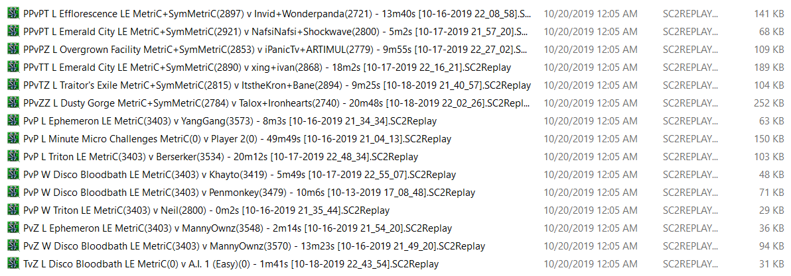

# SC2 Replay Renamer
A feature-rich StarCraft II replay renamer, inspired by [Burny's SC2 Replay Renamer](https://github.com/BurnySc2/SC2-Replay-Renamer), with (hopefully) a simpler UI. Removed functions that you (probably) won't need, added some that you (definitely) would need.

## Windows Installation
1. Download the latest version from [Releases](https://github.com/derickboss1/sc2-replay-renamer/releases)
1. Alternatively, you can build from the source by running `build.bat`. With the default configurations, the executable will be located in `dist/`

## Python
1. Download the required modules by running `pip install -r requirements.txt`
1. run `python run.py`

## Features
* Batch renaming of many replays
* Automatic renaming of new replays
* Running as a tray application
* You can also filter by:
  * Custom games
  * Team games
  * Games against AI
  * Games in subfolder that you do not wish to be renamed

## Documentation
`Template` is a string that represents the pattern you wish to name your replay files after. It should contain variables and should make sure every file has a unique name (usually, this can be quickly solved by putting `$uniqueID` somewhere in your `Template` string)

`team` refers to all of the players on a given side. This also applies to 1v1/ladder games

`ladder` refers to all `1v1` games that are not custom. Unranked games are considered `ladder`

Does not support `Random`! This means that the race displayed will be the in game race

### Rename Operations
- `Rename Template` is the field where you insert a template string to rename your replays to.
- `Replay Folder` is the folder where you keep your replays
- `Destination Folder` is the folder where you want to copy/move your newly renamed replays to
- `Player ID` is your game ID. Press the detect button to find it for you.
- `File Operation` - `Copy` keeps your original files. `Move` does not.

#### Template Variables
Variable | Explanation | Requires Player ID
---------|---------------|:-----------------:
$myraces |  Races on your team | :heavy_check_mark:
$WL | `W` if you won; `L` if you lost (UPPERCASE). If no ID supplied, then displays whether team1 won | 
$wl | `w` if you won; `l` if you lost (lowercase) | 
$myteam | Names of players on your team | :heavy_check_mark:
$myteamwithmmr | Names of players on your team, with your team's MMR Ex. Serral(7500) | :heavy_check_mark
$mymmr | average MMR of your team | :heavy_check_mark:
$oppteams | Names of players on opponent team(s). If FFA, contains all teams except yours, separated with a `v` e.g. SerralvMaru | :heavy_check_mark:
$oppwithmmr | Names of players on their team, with their MMR Ex. Serral(7500) | :heavy_check_mark:
$oppraces | Races on opponent team | :heavy_check_mark:
$oppmmr | average MMR of opponents, DO NOT USE IF YOU HAVE AN FFA REPLAY. Use `$oppwithmmr` instead | :heavy_check_mark:
$team1 | Names of players on team 1 | 
$team2 | Names of players on team 2. If FFA, contains every other team | 
$t1races | Races on team 1 | 
$t2races | Races on team 2 | 
$t1mmr | MMR of team 1 | 
$t2mmr | MMR of team 2 | 
$durationhours | humber of hours of replay |
$durationmins | number of minutes of replay (excludes remaining seconds) | 
$durationsecs | number of remaining seconds of replay (between 0 and 59) | 
$month | Month you played the game (01 to 12) | 
$day | Day of month you played the game | 
$year | Year you played the game | 
$hour | Hour you played the game (00 to 23) | 
$min | Minute you played the game (00 to 59) | 
$sec | Second you played the game (00 to 59) | 
$map | Name of the map you played on | 
$gametype | Type of the game (1v1, 2v2, FFA) | 
$expansion | WoL, HotS, or LotV | 
$currentname | the current name of the file, before renaming |
$uniqueID | unique identifier for your replay to prevent renaming to the same name | 

#### Examples
```
$myracesv$oppraces $WL $map $myteamwithmmr v $oppwithmmr - $durationminsm$durationsecss [$month-$day-$year $hour_$min_$sec]
----------------------------------------------------------------------------------------------------------------------------------

Ladder Games = PvT L Thunderbird LE CannonRusher(3500) v TerranPlayer(3535) - 5m10s [10-16-2019 10_30_25].SC2Replay
Games with Random = TvT W Acropolis LE RandomPlayer(5533) v SaltyTerran(5500) - 15m13s [10-16-2019 10_30_25].SC2Replay
Team Games = PTvTZ L Efflorescence LE CannonRusher+SaltyTerran(4500) v TerranPlayer+ZergPlayer(4000) - 20m58s [10-16-2019 10_30_25].SC2Replay
```

### Exclusions
- `Exclude Games with AI` prevents any replays that has a computer player from being renamed
- `Exclude Custom Games` prevents custom games from being renamed (limits to only ranked and unranked)
- `Exclude Directories` prevents subfolders in your `Replay Folder` from being renamed. You only need the subfolder name, NOT THE ENTIRE PATH

### Inclusions
- `min players` sets the lower bound of the number of players for the replay to be renamed
- `max players` sets the upper bound. All replays containing more than the max or less than the min will be excluded
- `WoL`, `HotS`, `LotV` - Includes the replays to be renamed if the checkbox is checked

### Matchups
- `Exclude Matchups` excludes all matchups listed, separated by commas. Note that `PvT` is different from `TvP`, so you have to include both to exclude them both (e.g. `PvT, TvP`)
- `Include Matchups` includes only the matchups you specify, excluding all others. By default, empty includes ALL matchups
- `Random` is not supported!!! Only the three races `P`, `Z`, and `T` will be recognized

### Miscellaneous
- The `Automatically rename new replay files` runs this tool as a tray application. It will watch when a new replay is added, and then rename it according to your template.

# Screenshots


Before | After
:-----:|:-----:
 | 


## Contributors
* Derick Tseng (derickboss1@gmail.com)